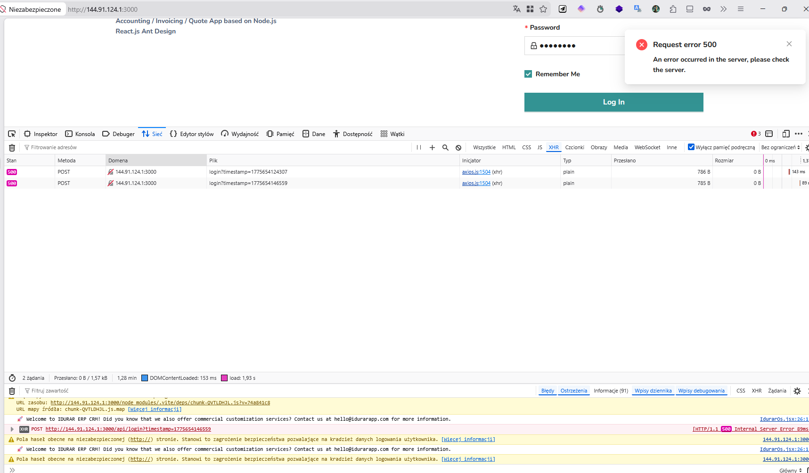
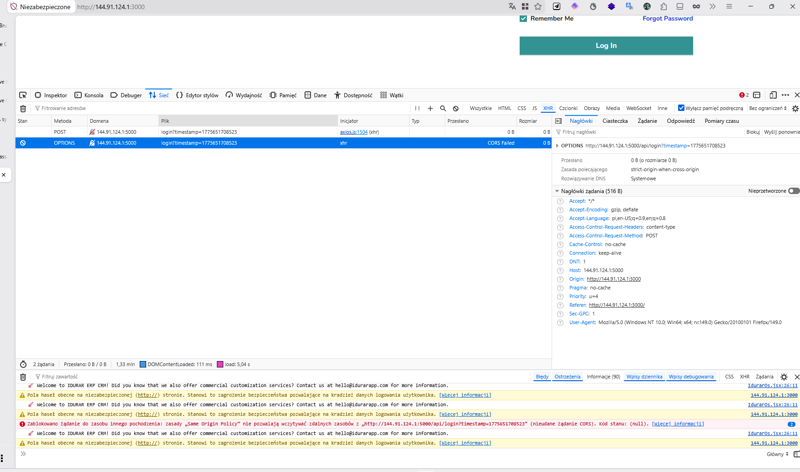

# 🐞 BUG-LOGIN-001 – Login request blocked due to CORS policy

## 📌 Summary
User is unable to log in because the login request is blocked by the browser due to CORS policy (Same Origin Policy).

---

## 🧭 Environment
- Environment: Local (Docker on VPS)
- Frontend: http://144.91.124.1:3000
- Backend: http://144.91.124.1:5000
- Browser: Firefox

---

## 🔁 Steps to Reproduce
1. Open the application
2. Navigate to login page
3. Enter valid credentials (e.g. admin@admin.com / admin123)
4. Click "Log In"

---

## ✅ Expected Result
User should be authenticated and redirected to the dashboard.

---

## ❌ Actual Result
Login request is blocked by the browser due to CORS policy.  
Request does not reach backend.

---

## 📊 Severity / Priority
- Severity: 🔥 High (blocks core functionality)
- Priority: High

---

## 📎 Evidence

### 1. CORS blocked request (main issue)


---

### 2. Network tab – CORS failure (OPTIONS request)


---

### 3. Internal server error (after partial fixes)


---

### 4. Wrong backend port configuration (root cause extension)


---

## 🧠 Root Cause Analysis
- Frontend runs on **port 3000**
- Backend runs on **port 5000**
- Browser blocks cross-origin requests (Same Origin Policy)
- Backend initially lacked proper CORS configuration
- Additional issue: incorrect backend port mapping in Docker

---

## 🛠️ Fix Applied

### Backend – enable CORS
```js
app.use(cors({
  origin: true,
  credentials: true,
}));
```

### Additional headers:
```js
res.header('Access-Control-Allow-Origin', 'http://144.91.124.1:3000');
res.header('Access-Control-Allow-Methods', 'GET,POST,PUT,DELETE,OPTIONS');
res.header('Access-Control-Allow-Headers', 'Content-Type, Authorization');
```

### Docker fix (port mismatch)
```yaml
ports:
  - "5000:8888"
```

---

## 📈 Result After Fix
- CORS error resolved
- Requests reach backend successfully
- Login flow proceeds to next stage (data validation)

---

## 🧠 QA Notes
This issue blocked all authentication-related testing.  
It required **environment + backend configuration fixes**, not just UI testing.

---

## 🏷️ Type
- Integration Bug
- Configuration Issue
- Environment Issue

---

## 🔗 Related Analysis

Full investigation:
👉 [Login Investigation](../docs/LOGIN-INVESTIGATION.md)
