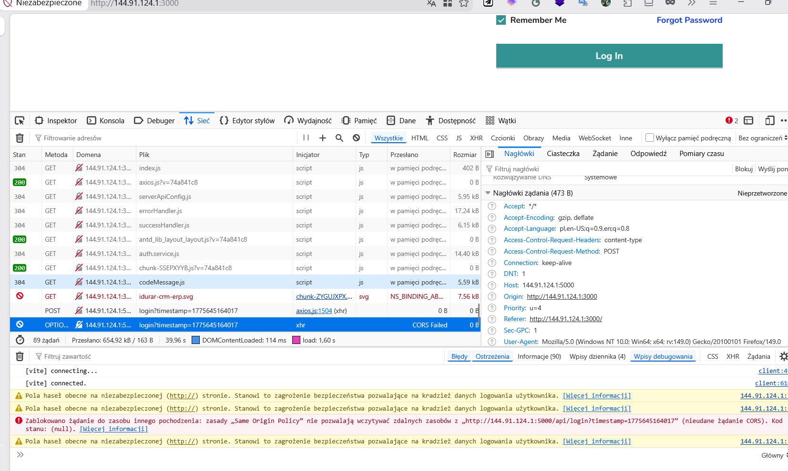

# 🐞 BUG-LOGIN-001 – Login request blocked due to CORS policy

## 📌 Summary
User is unable to log in because the login request is blocked by the browser due to CORS policy.

---

## 🧭 Environment
- Environment: Local (Docker on VPS)
- Frontend: http://144.91.124.1:3000
- Backend: http://144.91.124.1:5000
- Browser: Firefox

---

## 🔁 Steps to Reproduce
1. Open the application
2. Navigate to login page
3. Enter valid credentials (e.g. admin@admin.com / admin123)
4. Click "Log In"

---

## ✅ Expected Result
User should be authenticated and redirected to the dashboard.

---

## ❌ Actual Result
Login request is blocked by the browser due to CORS policy. User cannot log in.

---

## 📊 Severity / Priority
- Severity: 🔥 High (blocks core functionality)
- Priority: High

---

## 📎 Evidence

---

## 🧠 Additional Notes
- Error visible in browser console:
  - "Same Origin Policy"
  - "CORS Failed"
- Request sent to: http://144.91.124.1:5000/api/login
- Frontend and backend are running on different ports (3000 vs 5000)

---

## 🏷️ Type
- Integration Bug
- Configuration Issue