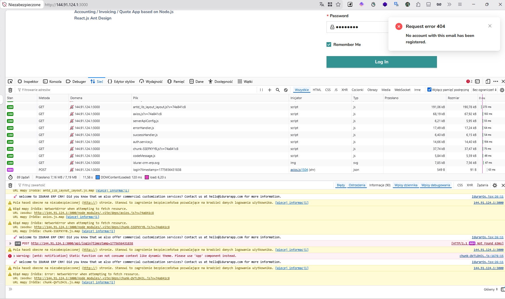

# 🐞 BUG-LOGIN-002 – Missing default admin account after deployment

## 📌 Summary
User is unable to log in because no admin account exists in the database after fresh deployment.

---

## 🧭 Environment
- Environment: Local (Docker on VPS)
- Frontend: http://144.91.124.1:3000
- Backend: http://144.91.124.1:5000
- Database: MongoDB (containerized)
- Browser: Firefox

---

## 🔁 Steps to Reproduce
1. Deploy application using Docker
2. Open application in browser
3. Navigate to login page
4. Enter credentials (e.g. admin@admin.com / admin123)
5. Click "Log In"

---

## ✅ Expected Result
System should:
- either contain a default admin account  
- or provide a way to create the first user  

User should be able to log in.

---

## ❌ Actual Result
- Login request returns **404**
- Message: *"No account with this email has been registered"*
- Authentication is impossible

---

## 📊 Severity / Priority
- Severity: 🔥 High (blocks core functionality)
- Priority: High

---

## 📎 Evidence

### 1. Login response (404)

### 2. Database state (empty admins collection)

---

## 🧠 Root Cause Analysis
- MongoDB database is initialized without seed data
- `admins` collection exists but is empty
- No default admin user is created during deployment
- Login endpoint works correctly but cannot find any user

---

## 🛠️ Possible Fixes

### Option 1 – Seed default admin
Create a default admin user during startup

### Option 2 – Registration flow
Provide UI/API to create first admin account

### Option 3 – Documentation
Clearly document required manual setup

---

## 📈 Result After Investigation
- Login flow works correctly on technical level
- Issue is caused by missing data, not broken logic
- System becomes usable after adding admin user

---

## 🧠 QA Notes
This issue was discovered after resolving CORS and connectivity problems.  
It highlights importance of **test data availability** in system usability.

---

## 🏷️ Type
- Functional Issue (User Data)
- Configuration / Environment Issue
- Deployment Gap
---

## 🔗 Related Analysis

Full investigation:
👉 [Login Investigation](../docs/LOGIN-INVESTIGATION.md)
