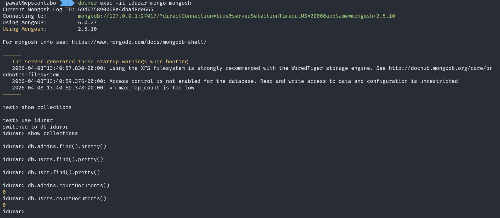
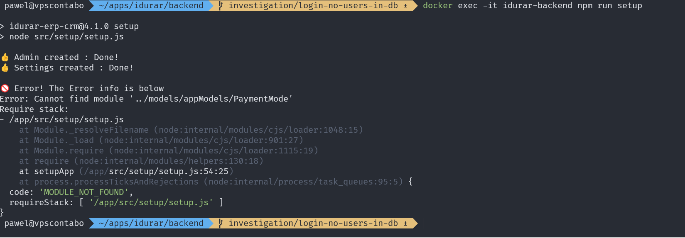
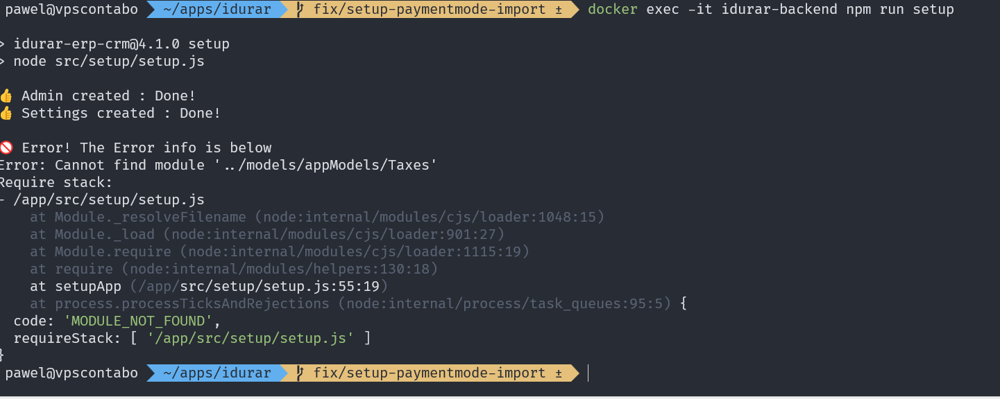

# 🐞 BUG-SETUP-001 – Initial setup script is broken due to outdated model references

## 📌 Summary
The application setup script fails during execution due to multiple references to non-existing modules.  
This prevents full environment initialization and blocks further testing.

---

## 🧭 Environment
- Environment: Docker (VPS)
- Backend: Node.js (containerized)
- Database: MongoDB

---

## 🔁 Steps to Reproduce
1. Run backend setup script:
   ```bash
   docker exec -it idurar-backend npm run setup
   ```

2. Observe console output

---

## ❌ Actual Result

Setup process fails with errors such as:

Error: Cannot find module '../models/appModels/PaymentMode'

After partial fix:

Error: Cannot find module '../models/appModels/Taxes'

---

## ✅ Expected Result

Setup script should complete successfully and initialize:
- default admin user
- settings
- taxes
- payment modes

---

## 🔍 Investigation

### Step 1 – Database Validation
- No users found in database
- No collections initialized

### Step 2 – Repository Analysis
- Setup script found in: backend/src/setup/setup.js
- Script is responsible for creating:
  - admin user
  - settings
  - taxes
  - payment modes

### Step 3 – Setup Execution
- Script executed using:
  docker exec -it idurar-backend npm run setup

- Partial success:
  - Admin created ✅
  - Settings created ✅

- Then failure occurred ❌

### Step 4 – Model Verification

Directory:
backend/src/models/appModels

Contains:
- Client.js  
- Invoice.js  
- Payment.js  

Missing:
- PaymentMode.js ❌
- Taxes.js ❌

---

## 💡 Root Cause

The setup script references outdated or non-existing modules:

require('../models/appModels/PaymentMode')
require('../models/appModels/Taxes')

---

## 🎯 Impact

- Setup process is incomplete  
- Application environment is not fully initialized  
- Login functionality is blocked (no valid users)  
- Further testing cannot proceed  

---

## 📸 Evidence

### 1. No users in database



---

### 2. Setup script error – missing PaymentMode



---

### 3. Setup script error – missing Taxes



---

## 🧠 Conclusion

The issue is not limited to missing data, but originates from a broken setup script that is not aligned with the current application model structure.

This indicates a deeper maintenance issue in the project setup logic.
