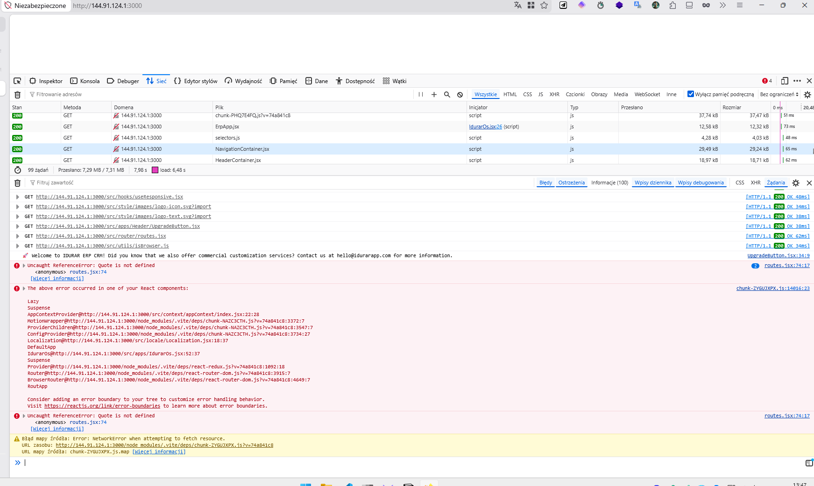
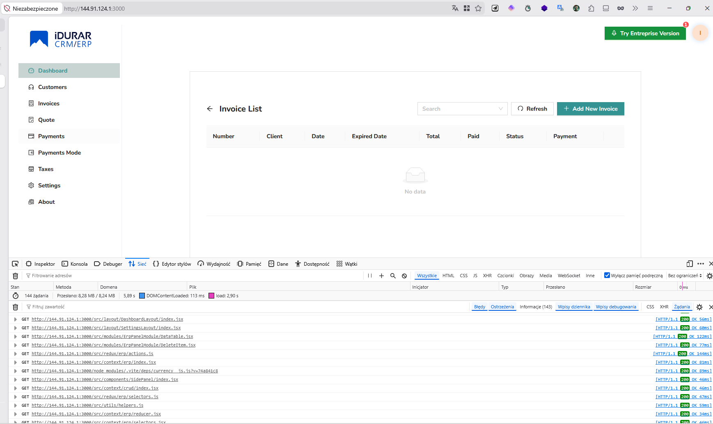

# 🧪 iDURAR E2E QA Testing Project

## 🚀 Overview

This repository demonstrates a **real-world, end-to-end QA process** performed on the iDURAR ERP/CRM system.

The project simulates real QA responsibilities in a production-like environment:

- test analysis & planning  
- test design & execution  
- defect reporting  
- debugging & root cause analysis  
- system-level investigation  

👉 Focus: **practical QA skills + real defects + full traceability**

---

## 🏆 Key Achievements

- 🔥 Resolved **multi-layer system failures** blocking application startup and login
- 🔍 Performed **end-to-end debugging** across:
  - frontend (React / Vite)
  - backend (Node.js / Express)
  - database (MongoDB)
  - infrastructure (Docker / VPS)
- 🧠 Conducted **root cause analysis**, not just symptom reporting
- 🐞 Identified **critical defects** affecting core functionality
- 🔗 Established **traceability (Issue ↔ Bug Report ↔ Fix)**

---

## 📸 Screenshots / Evidence Preview

### ❌ Before Fix – Application Crash

### ✅ After Fix – Successful Login

👉 Full evidence available in `/assets/evidence/`

---

## 🐞 Key Bugs Found

### 🔴 BUG-FRONTEND-ROUTES-001 – Application crash after login

**Summary:**  
Application crashed with a white screen after login due to undefined route components.

**Impact:**  
- Blocked access to the system  
- Critical functionality unavailable  

**Root Cause:**  
Routes referenced missing components:
- Quote
- QuoteCreate
- QuoteRead
- QuoteUpdate
- PaymentMode
- Taxes  

**Fix:**  
Removed invalid routes referencing non-existent components.

**Links:**  
- 📄 [Bug Report](./03-bug-reports/BUG-FRONTEND-ROUTES-001.md)  
- 🐞 [GitHub Issue #4](https://github.com/pawelbrudniak/idurar-e2e-qa-testing/issues/4)

---

### 🔴 BUG-SETUP-001 – Setup script failure

**Summary:**  
Application setup failed due to invalid and outdated model references.

**Impact:**  
- Blocked environment setup  
- Prevented all testing activities  

**Root Cause:**  
- Missing models (`PaymentMode`, `Taxes`)  
- Invalid seed logic for `Payment`  

**Fix:**  
- Removed obsolete model references  
- Cleaned setup script logic  

---

## 🔍 Login Flow Investigation (Case Study)

👉 📄 [Login Investigation Report](./docs/LOGIN-INVESTIGATION.md)

---

## 📊 QA Workflow

👉 [QA Board](https://github.com/users/pawelbrudniak/projects/3)

---

## 🧠 QA Approach

- risk-based thinking  
- traceability  
- exploratory testing  
- system-level debugging  

---

## 🧩 Lessons Learned

- 🔁 Real-world bugs often appear as **chains of defects**, not single issues  
- 🧠 Fixing one layer (backend) can reveal issues in another (frontend)  
- 🔍 Debugging requires understanding **full system flow**, not just UI  
- ⚙️ Environment issues (Docker, ports, CORS) are common real blockers  
- 📊 Proper documentation increases the value of QA work significantly  

---

## 💼 CV / Interview Angle

This project demonstrates:

- end-to-end QA ownership  
- technical debugging skills  
- real defect analysis  
- ability to communicate findings clearly  

---

## 🎯 What This Shows

- independent problem solving  
- understanding of real QA workflows  
- technical awareness beyond UI testing  
- structured thinking  

---

## 📌 Note

This is a **QA-focused project**.

The goal is to:

- evaluate system quality  
- identify real defects  
- simulate professional QA work  
- document findings clearly  

---

## 🔗 References

- https://github.com/idurar/idurar-erp-crm  
- https://cloud.idurarapp.com  
