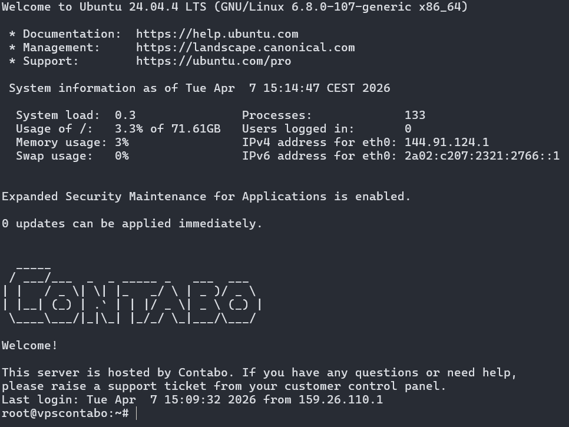

# 🖥️ VPS Setup & Security Configuration (Contabo)

## 🎯 Objective

The goal was to prepare a secure VPS environment for future deployment of the iDURAR application, accessible via HTTPS.

---

## 🔧 1. Initial Server Access

Connected to the VPS via SSH as the `root` user:

```bash
ssh root@144.91.124.1
```

---

## 🏷️ 2. Hostname Configuration

Changed the hostname for better environment identification:

```bash
hostnamectl set-hostname vpscontabo
```

Updated `/etc/hosts`:

```bash
127.0.1.1 vpscontabo
```

---

## 👤 3. Creating a Non-Root User

To avoid working as root, a new user was created:

```bash
adduser pawel
```

---

## 🛡️ 4. Granting Sudo Privileges

Added the user to the sudo group:

```bash
usermod -aG sudo pawel
```

Verification:

```bash
groups pawel
```

---

## 🔐 5. SSH Key Authentication Setup

### Create `.ssh` directory

```bash
mkdir -p /home/pawel/.ssh
```

### Add public key

File:

```bash
/home/pawel/.ssh/authorized_keys
```

Contains public key from:

```
C:\Users\pawel\.ssh\id_ed25519.pub
```

---

## 🔑 6. Setting Permissions

```bash
chown -R pawel:pawel /home/pawel/.ssh
chmod 700 /home/pawel/.ssh
chmod 600 /home/pawel/.ssh/authorized_keys
```

---

## ✅ 7. SSH Login Verification

Login test:

```bash
ssh pawel@144.91.124.1
```

Verification:

```bash
whoami
```

---

## 🔒 8. Sudo Access Verification

```bash
sudo whoami
```

Expected result:

```
root
```

---

## 🚫 9. SSH Hardening

Edited:

```bash
/etc/ssh/sshd_config
```

Changes:

```bash
PermitRootLogin no
PasswordAuthentication no
```

Restart SSH:

```bash
systemctl restart ssh
```

---

## 🔥 10. Firewall Configuration (UFW)

Allow SSH:

```bash
ufw allow OpenSSH
```

Enable firewall:

```bash
ufw enable
```

Check status:

```bash
ufw status
```

Expected result:

```
Status: active
OpenSSH ALLOW Anywhere
```

---

# 🧠 Why These Steps Matter

This configuration was implemented to:

- minimize the risk of unauthorized access (disable root and password login)
- enforce controlled privilege escalation (sudo instead of root)
- reduce attack surface (firewall restrictions)
- prepare a secure environment for application deployment

This setup follows common production security best practices.

---

# 🧪 Configuration Verification

| Test Case | Expected Result | Status |
|----------|---------------|--------|
| SSH login via key | Access without password | ✅ |
| Root login | Blocked | ✅ |
| Password authentication | Disabled | ✅ |
| Sudo access | Works correctly | ✅ |
| Firewall | Only SSH allowed | ✅ |

---

# ⚠️ Risks Identified

- Misconfiguration of SSH may lock out server access
- No backup before critical configuration changes
- Open SSH port exposed to brute-force attempts

---

# 🛡️ Mitigation Strategies

- Verified SSH access before disabling root login
- Used SSH key authentication instead of passwords
- Restricted access using firewall rules

