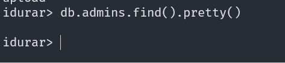

# 🔍 INVESTIGATION-LOGIN-001 – No Users Found in Database

## Summary
During login issue investigation, the database was inspected directly via MongoDB shell.

## Findings
The `idurar` database does not contain user data required for authentication.

### Evidence
- `show collections` returned no collections in the `idurar` database
- `db.admins.countDocuments()` returned `0`
- `db.users.countDocuments()` returned `0`

This indicates that no application users are currently available in the database.

## Impact
Login cannot succeed because there are no valid users to authenticate with.

## Conclusion
This is currently a test blocker / environment setup issue.  
Before login functionality can be properly tested, at least one valid user account must exist in the database or be created through the supported application flow.

## Evidence Screenshot


## 🔍 Additional Investigation

The setup script was executed using the official command:

```bash
npm run setup
```

The script partially succeeded:

Default admin user was created
Application settings were initialized

However, the process failed with the following error:

Error: Cannot find module '../models/appModels/PaymentMode'

This indicates a missing or incorrectly referenced module, causing the setup process to terminate prematurely.

🎯 Impact
Setup process is incomplete
Some system data (e.g. PaymentMode) is not initialized
Environment cannot be considered fully ready for testing

📸 Evidence
